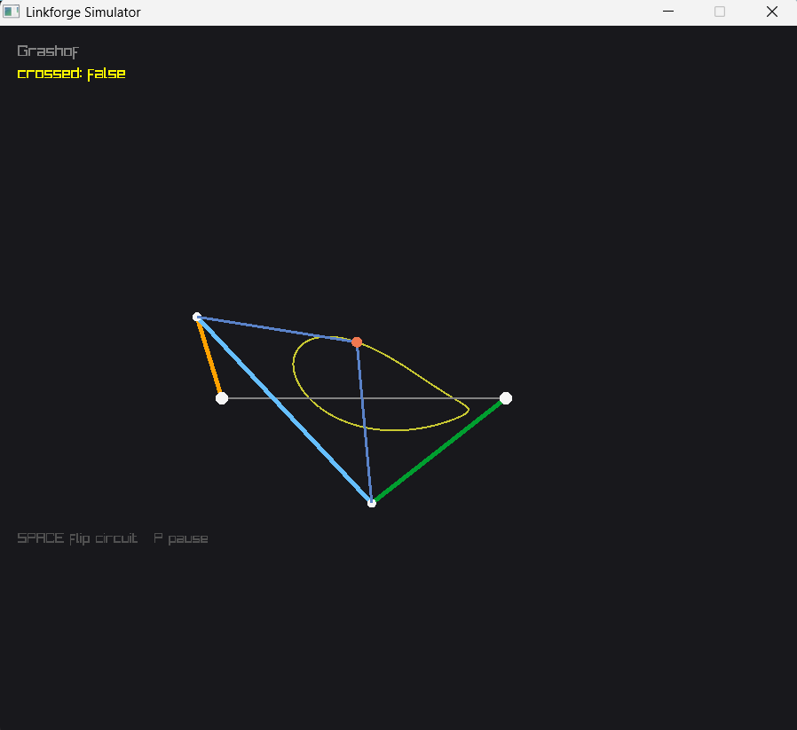

# Linkforge

A four-bar linkage simulator I wrote in C++ with raylib.

You give it the link lengths, and it works out where every joint sits as the crank turns, animates the whole thing, and draws the path traced by a point on the coupler link. It also checks the Grashof condition so you can tell straight away whether the crank is actually able to go all the way round.



## What it does

- Works out the linkage position in real time as the crank rotates
- Draws the coupler curve while the mechanism runs
- Tells you the Grashof classification for whatever link lengths you have given it
- Lets you switch between the open and crossed assembly at runtime
- Pauses so you can stop and look at a particular position

## Controls

| Key | What it does |
|-----|--------------|
| `SPACE` | Flip between the open and crossed circuit |
| `P` | Pause and resume |

## Why I built it

Most linkage tools either hide the maths behind a nice interface or sit inside a full CAD package. I wanted to write the kinematics myself, starting from the loop closure equations, and watch the coupler curve come out of my own solver instead of someone else's.

It is also the first piece of something bigger I am working towards, which is taking geometry I have designed in CAD, pulling it into a simulator I have written, and running actual physics on it.

## Building

You will need a C++17 compiler, CMake 3.15 or newer, and raylib.

```bash
git clone https://github.com/akagramishra/Linkforge-Simulator.git
cd Linkforge-Simulator
cmake -B build
cmake --build build
./build/linkforge
```

## How it works

A four-bar linkage only has one degree of freedom, so once you fix the crank angle everything else is determined. Linkforge walks the vector loop around the mechanism and solves for the two unknown link angles on every frame.

That system has two valid answers, which correspond to the two different ways the same linkage can be put together. That is what the circuit toggle is switching between, and it is why the shape can suddenly look inverted when you press space.

The Grashof check is simpler. It compares the shortest and longest links against the other two. If the shortest plus the longest is less than or equal to the sum of the remaining pair, then at least one link can make a full rotation. Linkforge runs that check on the current link set and prints the result in the corner.

## What is next

- Editing link lengths from inside the application instead of in code
- Picking any point on the coupler to trace, not just a fixed one
- Velocity and acceleration analysis
- Bringing in part geometry from CAD
- Heat conduction and flow simulation over that geometry

## License

MIT